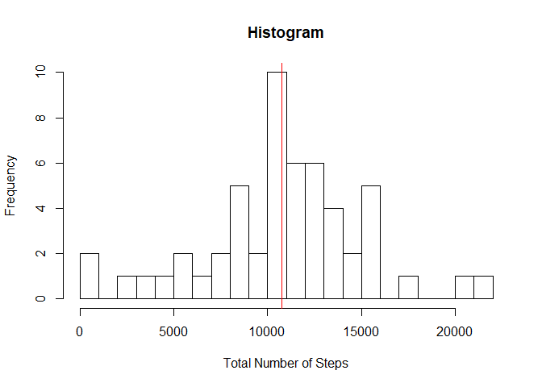
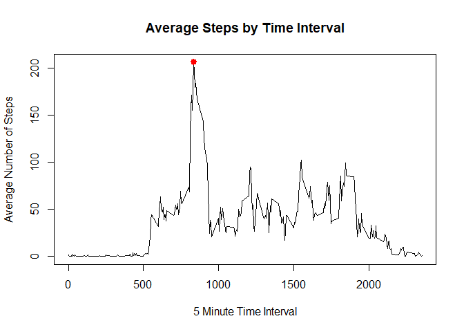
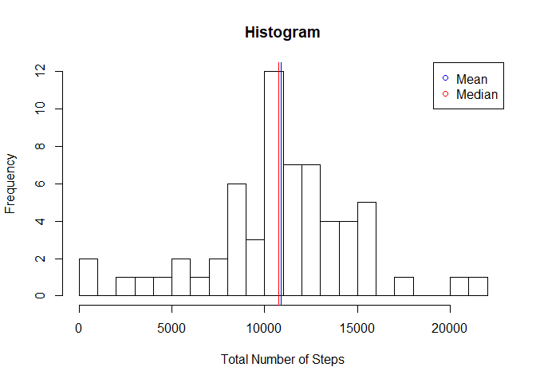
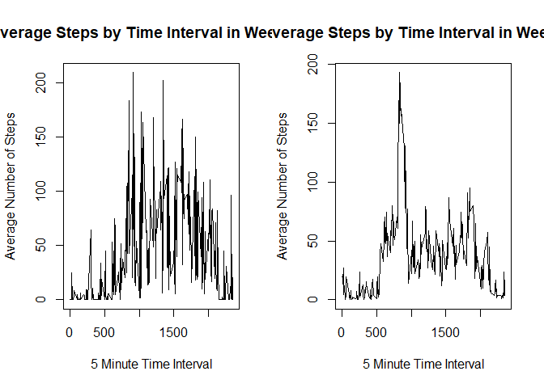

# Reproducible Research: Peer Assessment 1


## Loading and preprocessing the data

First step will be to load the required package and download the data directly in the folder.


```r
  require(dplyr)
```

```
## Loading required package: dplyr
```

```
## Warning: package 'dplyr' was built under R version 3.4.1
```

```
## 
## Attaching package: 'dplyr'
```

```
## The following objects are masked from 'package:stats':
## 
##     filter, lag
```

```
## The following objects are masked from 'package:base':
## 
##     intersect, setdiff, setequal, union
```

```r
  if(!file.exists("PA")){
    dir.create("PA")
  }

    fileurl <- "https://d396qusza40orc.cloudfront.net/repdata%2Fdata%2Factivity.zip"

    download.file(fileurl,destfile="./PA/PA.zip")
    filelist<-unzip("./PA/PA.zip")

    date_download<-date()

    f1<-tbl_df(read.csv(filelist))
```

Next is to inspect the acquired data.Turns out the table consists of 3 variables.  
1. Steps  
2. Date  
3. Interval


```r
    head(f1)
```

```
## # A tibble: 6 x 3
##   steps       date interval
##   <int>     <fctr>    <int>
## 1    NA 2012-10-01        0
## 2    NA 2012-10-01        5
## 3    NA 2012-10-01       10
## 4    NA 2012-10-01       15
## 5    NA 2012-10-01       20
## 6    NA 2012-10-01       25
```

```r
    str(f1)
```

```
## Classes 'tbl_df', 'tbl' and 'data.frame':	17568 obs. of  3 variables:
##  $ steps   : int  NA NA NA NA NA NA NA NA NA NA ...
##  $ date    : Factor w/ 61 levels "2012-10-01","2012-10-02",..: 1 1 1 1 1 1 1 1 1 1 ...
##  $ interval: int  0 5 10 15 20 25 30 35 40 45 ...
```

```r
    summary(f1)
```

```
##      steps                date          interval     
##  Min.   :  0.00   2012-10-01:  288   Min.   :   0.0  
##  1st Qu.:  0.00   2012-10-02:  288   1st Qu.: 588.8  
##  Median :  0.00   2012-10-03:  288   Median :1177.5  
##  Mean   : 37.38   2012-10-04:  288   Mean   :1177.5  
##  3rd Qu.: 12.00   2012-10-05:  288   3rd Qu.:1766.2  
##  Max.   :806.00   2012-10-06:  288   Max.   :2355.0  
##  NA's   :2304     (Other)   :15840
```


## What is mean total number of steps taken per day?

Next step is to see how many steps were taken per day (exclusing the NA rows)


```r
  dat<-group_by(filter(f1,!is.na(steps)),date)
```

```
## Warning: package 'bindrcpp' was built under R version 3.4.1
```

```r
  dat_sum<- summarize(dat,sum(steps))
  
  dat_mean<-round(mean(dat_sum$`sum(steps)`))
  dat_median<-median(dat_sum$`sum(steps)`)
  
  
  hist(dat_sum$`sum(steps)`, breaks= 20, main = 'Histogram',xlab = 'Total Number of Steps')
  
  abline(v=dat_mean, lwd = 1, col = 'blue')
  abline(v=dat_median, lwd = 1, col = 'red')
```

<!-- -->

Upon calculating the mean and median.

Mean = 1.0766\times 10^{4}
Median = 10765

Their values somewhat conincide.
  
  
  

## What is the average daily activity pattern?


Now we shall construct a timeseries plot, where we will visulise the number of steps taken throughout the time interval


```r
  dat<-group_by(filter(f1,!is.na(steps)),interval)

  dat_mean<- summarize(dat,mean(steps))
  
  max_v<-dat_mean[which.max(dat_mean$`mean(steps)`),]
  max_v_step = max_v$`mean(steps)`
  
  
  plot(dat_mean$interval,dat_mean$`mean(steps)`,type = 'l',main = 'Average Steps by Time Interval',xlab     ='5 Minute Time Interval',ylab = 'Average Number of Steps')
  
   points(max_v$interval,max_v$`mean(steps)`, col = 'red', lwd = 3, pch = 19)
```

<!-- -->

Maximum value at 835 is 206.1698113


## Imputing missing values

We will impute the missing value using the Mice (multiple imputation by chained equation) function from mice package.

You need to create a dataframe with the variable you want to impute, and include every variable that might predict values of that variable (so every var. in your model + possibly other var. as well). The mice package will impute every missing value in that dataframe.


```r
library(mice)
```

```
## Warning: package 'mice' was built under R version 3.4.1
```

```r
imputed_data<-mice(f1, m = 2, maxit = 50, method = 'pmm', seed = 500)
imputed_data$imp$steps
complete_Data<-complete(imputed_data,2)
```


```r
head(complete_Data)
```

```
##   steps       date interval
## 1     0 2012-10-01        0
## 2     0 2012-10-01        5
## 3   380 2012-10-01       10
## 4   156 2012-10-01       15
## 5   475 2012-10-01       20
## 6   489 2012-10-01       25
```

```r
complete_Data <- group_by(complete_Data, date)
complete_sum<- summarize(complete_Data,sum(steps))

hist(complete_sum$`sum(steps)`, breaks= 20, main = 'Histogram',xlab = 'Total Number of Steps')

completed_mean<-round(mean(complete_sum$`sum(steps)`))
completed_median<-median(complete_sum$`sum(steps)`)

abline(v=completed_mean, lwd = 1, col = 'blue')
abline(v=completed_median, lwd = 1, col = 'red')
legend("topright",pch = 1, col = c("blue","red"),legend = c("Mean","Median"))
```

<!-- -->


## Are there differences in activity patterns between weekdays and weekends?


We will filter out Weekends and Weekdays using as.Date function and then plotting the Average steps against interval

```r
complete_Data$days<-weekdays(as.Date(complete_Data$date))


weekends<-filter(complete_Data,days == c("Saturday","Sunday"))
weekdays<-filter(complete_Data,days != c("Saturday","Sunday"))

weekends<-group_by(weekends,interval)
weekdays<-group_by(weekdays,interval)

weekends_mean<- summarize(weekends,mean(steps))
weekdays_mean<-summarize(weekdays,mean(steps))

par(mfrow = c(1, 2))
plot(weekends_mean$interval,weekends_mean$`mean(steps)`,type = 'l',main = 'Average Steps by Time Interval in Weekend',xlab ='5 Minute Time Interval',ylab = 'Average Number of Steps')

plot(weekdays_mean$interval,weekdays_mean$`mean(steps)`,type = 'l',main = 'Average Steps by Time Interval in Weekday',xlab ='5 Minute Time Interval',ylab = 'Average Number of Steps')
```

<!-- -->

